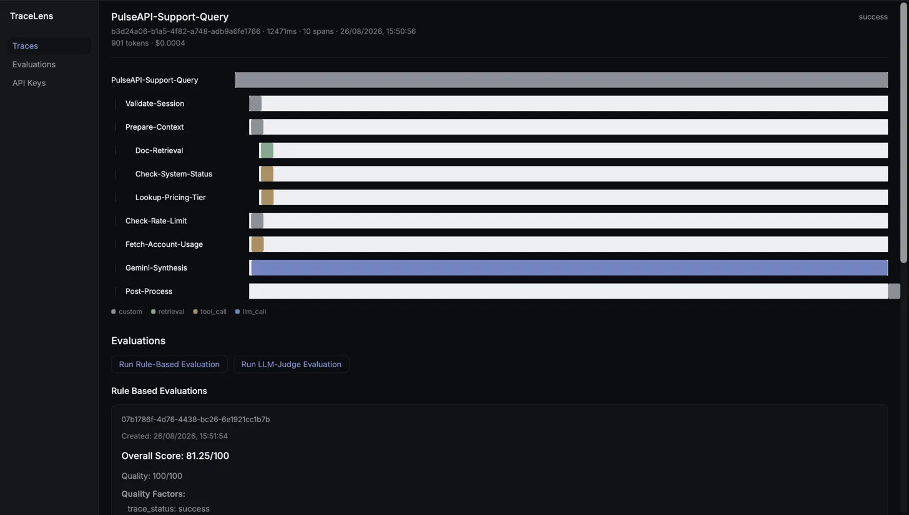

# TraceLens

A self-hosted observability platform for LLM and agent applications — capture, visualize, and evaluate traces from any AI workflow, with a dual evaluation engine (deterministic rules + LLM-as-judge) and a lightweight instrumentation SDK.

**TraceLens is built as a deep, end-to-end implementation of the core mechanisms behind LLM observability tooling — trace/span capture, async evaluation, session and API-key auth — rather than a production-scale replacement for hosted platforms like Langfuse or Braintrust.**

**Live app:** https://trace-lens-blond.vercel.app
**SDK on npm:** [`tracelens-sdk`](https://www.npmjs.com/package/tracelens-sdk)



---

## What it does

TraceLens lets you instrument any Node.js application — an LLM chatbot, a RAG pipeline, an agent with tool calls — with a few lines of SDK code, and see every step of execution as a nested, timed waterfall in a live dashboard. Each trace can be scored two ways: a deterministic rule-based evaluator (checking latency, cost, and error rate against configurable thresholds) and an LLM-as-judge evaluator (scoring correctness, relevance, completeness, clarity, and instruction-following via Gemini).

## Architecture

TraceLens deliberately separates two distinct authentication planes, since they serve different actors with different trust models:

- **Human / dashboard auth** — email + password → OTP-verified signup → server-side session (`express-session` + `connect-mongo`), never JWT
- **Machine / SDK auth** — a project-scoped API key (`tl_<lookupId>_<secret>`), verified via bcrypt against a stored hash, used only to authenticate ingestion — never usable to log into the dashboard, and vice versa
Dashboard (React) → session cookie → Express API → MongoDB
↑
Instrumented app → API key (Bearer) → /ingest
↓
Eval Worker (polls every 5s)
↓
Rule Evaluator / Gemini LLM Judge

## Key technical details

- **Concurrency-safe evaluation queue** — the async worker claims jobs via an atomic `findOneAndUpdate`, with stale-lock recovery (5-minute timeout) so a crashed worker never permanently blocks a job
- **Dual evaluation engine** — a weighted rule-based scorer (quality 50% / latency 25% / cost 25%) alongside an LLM-judge evaluator scoring five dimensions, with the final weighted score always computed server-side rather than trusted from the model's own arithmetic
- **Self-hosted SDK design** — [`tracelens-sdk`](https://www.npmjs.com/package/tracelens-sdk) uses `AsyncLocalStorage` for automatic nested-span context propagation, with no manual ID-passing required
- **Cross-origin session auth** — frontend and backend are deployed on separate domains (Vercel + Render); a Vercel rewrite proxy makes API requests same-origin from the browser's perspective, so session cookies work correctly under `SameSite=Lax` without weakening cookie security

## Tech stack

**Frontend:** React, Vite, React Router, plain CSS custom properties (no UI framework)
**Backend:** Node.js, Express, MongoDB, Mongoose
**Auth:** express-session, connect-mongo, bcrypt
**Email:** Resend
**LLM judge:** Google Gemini (`gemini-3.5-flash-lite`) via `@google/genai`
**SDK:** published independently to npm as `tracelens-sdk`
**Deployment:** Vercel (frontend), Render (backend), MongoDB Atlas (database)

## Project structure
tracelens/
├── api/ Express backend — auth, projects, ingest, eval worker
├── dashboard/ React frontend
├── sdk/ tracelens-sdk — published npm package
├── demo-app/ Example instrumented app (PulseAPI support assistant)

## Local setup

Clone the repo, then set up each piece:

```bash
git clone https://github.com/srinutyson/TraceLens.git
cd TraceLens
```

**Backend** (`api/`):
```bash
cd api
npm install
```
Create `.env`:
PORT=4000
MONGODB_URI=mongodb://localhost:27017/tracelens
SESSION_SECRET_KEY=<random string>
RESEND_API_KEY=<your Resend key>
GEMINI_API_KEY=<your Gemini key>
```bash
node server.js
```

**Frontend** (`dashboard/`):
```bash
cd dashboard
npm install
```
Create `.env`:
VITE_API_BASE_URL=http://localhost:4000/api
VITE_PUBLIC_API_URL=http://localhost:4000/api
```bash
npm run dev
```

**Demo app** (`demo-app/`) — optional, seeds a realistic multi-span trace:
```bash
cd demo-app
npm install
```
Create `.env`:
GEMINI_API_KEY=<your Gemini key>
TRACELENS_PROJECT_API_KEY=<a real project API key, created via the dashboard>
```bash
npm start
```

## Using the SDK in your own app

```bash
npm install tracelens-sdk
```

```js
import { TraceLens } from 'tracelens-sdk';

const tracer = new TraceLens({
  apiKey: 'tl_your_project_api_key',
  ingestUrl: 'https://your-tracelens-backend.example.com/api/ingest'
});

await tracer.trace('My-Workflow', async () => {
  await tracer.startSpan('Step-One', 'llm_call', async (childData) => {
    const result = 'answer';
    childData({ output: result, model: 'gemini-3.6-flash' });
    return result;
  });
});
```

See the [`tracelens-sdk` README](https://www.npmjs.com/package/tracelens-sdk) for full usage details.

## License

MIT